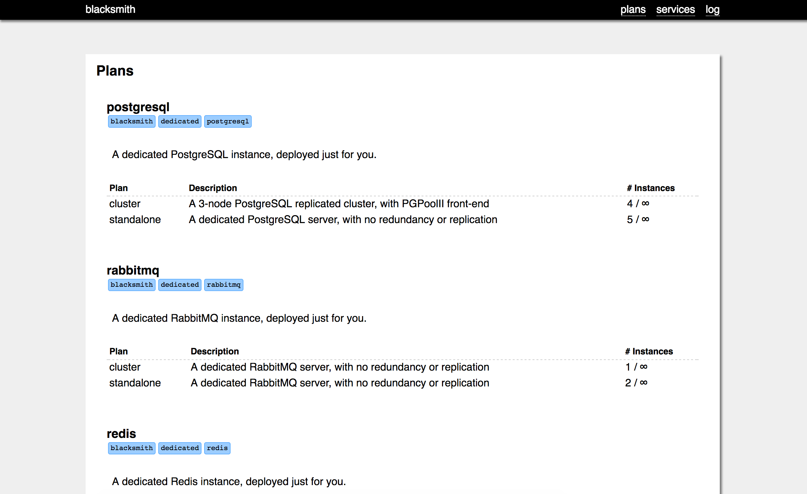
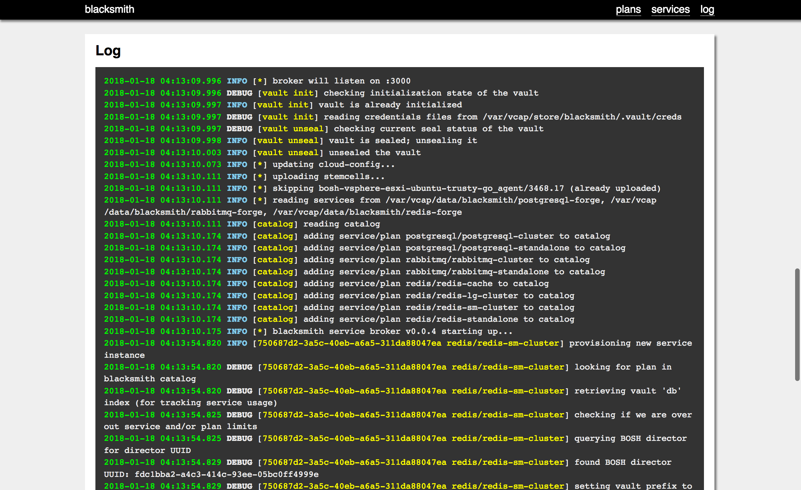

# Blacksmith BOSH Release

This is the BOSH release for deploying the Blacksmith Service
Broker for Cloud Foundry to your infrastructure of choice.

## Picking a BOSH Director

The largest architectural decision that needs to be made when
deploying Blacksmith is where do the deployments go?  You have two
options: use a shared external BOSH director, or deploy a custom
BOSH director to the Blacksmith VM.  The latter is out of scope
for this document (at the moment).

To use an external BOSH director, all you need to do is configure
the `bosh.*` manifest properties with the appropriate URLs and
credentials to access the director.  The **Manifest Properties**
section has details.

## Forge Integration

A Blacksmith without Forges isn't that useful.  In fact, it won't
even boot (the BOSH release has components that require at least
one plan to be defined).

You can avail yourself of these fine Blacksmith Forges:

  - [Redis][redis-forge] - Single-node and Master/Replica
    clustering options for persistent key-value stores and
    ephemeral caching.

  - [PostgreSQL][postgresql-forge] - Single-server and multi-node
    replicated cluster solutions for rock-solid database stuff.

  - [RabbitMQ][rabbitmq-forge] - Single- and multi-node RabbitMQ
    clusters for all your message bussing needs.

There are probably more.  Check out the [Blacksmith Community
Github organization][github] for the latest list of officially
supported forges!

## Deploying

An example manifest has been provided in
`manifests/blacksmith.yml`.  It requires the BOSH v2 CLI, and
needs you to provide some variables:

  - **bosh_ip** - The IP address of a BOSH director to use for
    service deployment.
  - **bosh_username** - Username to authenticate to BOSH as.
  - **bosh_password** - Password to authetnicate to BOSH as.
  - **blacksmith_ip** - A static IP address, in the `default`
    network, for deploying Blacksmith to.

This is just an example.  You will want to write your own operator
files to include a Forge or two, and configure your plans,
cloud-config, stemcells, etc.

Here's one possibly `bosh` incantation:

```sh
bosh deploy -d blacksmith                      \
               manifests/blacksmith.yml        \
            -v blacksmith_ip=10.0.0.6          \
            -v broker_password=BROKER-PASSWORD \
            -v bosh_username=admin             \
            -v bosh_password=SECRET-PASSWORD   \
            -v bosh_ip=10.0.0.4
```

Note that if your BOSH director has Credhub integrated, you don't
need to manually set the `broker_password` var; one will be
generated for you.

## Management Web UI

Blacksmith comes with a Management Web UI which lets operators
review the configured plans, enumerate the provisioned service
instances, and consult the most broker log buffers:






To access this interface, just point your browser to the same IP
and port that the service broker itself runs on, and log in with
the broker username and password, which defaults to `blacksmith` /
`blacksmith` (but consult your deployment manifest).

## Manifest Properties

The following manifest properties exist.

### debug: (true|false)

Enables debug logging on the `blacksmith` broker process.  This is
a LOT of logging, and not suitable for production deployments of
Blacksmith.  It does, however, come in super handy when you're
trying to troubleshoot why plans aren't showing up in the catalog,
why services won't provision, etc.

Defaults to `false` (no debugging)

### env: _Name of Your Environment_

The Blacksmith Management UI is a useful diagnostic tool for
inspecting the state of a running Blacksmith.  However, once you
get more than a few Blacksmith's up and running, you may have a
hard time telling their UIs apart.

This property sets an arbitrary string that will be displayed in
the header of the management interface, to help keep them
straight.

There is no default.  If you don't specify this, you don't get
anything identifying in the management interface.

### broker.username: _some-username_

A (preferably randomized) username to use to secure the Blacksmith
Broker, via HTTP Basic Authentication.  This username must be
provided to Cloud Foundry when you register the service broker.

Defaults to `blacksmith`, but you probably ought to change that.

### broker.password: _some-password_

A (preferably randomized) password to use to secure the Blacksmith
Broker, via HTTP Basic Authentication.  This password must be
provided to Cloud Foundry when you register the service broker.

Defaults to `blacksmith`, but you probably ought to change that.

### broker.port: 3000

The port to bind on and listen for HTTP traffic.  Defaults to
3000.  Note that this BOSH release does not currently support TLS,
so setting the port to 443 is probably a bad idea.

### bosh.address: _https://x.x.x.x:25555_

The full URL of the BOSH director that Blacksmith should use for
its service deployments.  This must include the scheme (http or
https), the IP address or FQDN, and the port (usually 25555).  The
name chosen must be listed in the directors certificate as a
Subject Alternative Name (SAN), for verification to work.

### bosh.username: _some-username_

The username of an account on the BOSH director (user, not UAA
client) that Blacksmith will use to perform service deployments.

Defaults to `admin`.

### bosh.password: _some-password_

The password of an account on the BOSH director (user, not UAA
client) that Blacksmith will use to perform service deployments.

Defaults to `admin`, which hopefully doesn't work.

### bosh.skip_ssl_validation: (true|false)

Whether or not to validate the TLS certificate presented by the
BOSH director when communicating with it.  In dev, with
self-signed certificates, this is usually permissible.  In
production, you should be using real certificates.

Note that recent vintages of the BOSH director use a self-issued
CA to sign the certificate, which isn't too far off from a
self-signed certificate.

Defaults to `true`.

### bosh.cloud-config: _(a cloud-config YAML chunk)_

This property lets you manage the cloud-config of the Blacksmith
BOSH director (configured via the `bosh.*` properties, above).
Every time Blacksmith starts up, it will upload this cloud-config
to the director, _overwriting any previous configuration_.  Don't
do this if Blacksmith is sharing its BOSH director with operations
folks, and other deployments.

The cloud-config itself is specified as real YAML, not a string.
So you want something like this:

```yaml
properties:
  bosh:
    cloud-config:
      azs:
        - name: z1
          cloud_properties: {...}
        - name: z2
          cloud_properties: {...}

      networks:
        - name: default
          # ...
```

### bosh.stemcells: _(list)_

When Blacksmith boots, it can upload stemcells that are going to
be referenced by Forge service deployments.  Since manifests
themselves are IaaS agnostic, they can only request vague stemcell
definitions like "I need ubuntu-trusty".  As an operator, you know
what stemcells will work on your infrastructure, and here is where
you list them.

Each entry in the list is a full stemcell specification, complete
with a name, version, URL, and SHA-1 checksum:

```
properties:
  bosh:
    stemcells:
      - name:     bosh-vsphere-esxi-ubuntu-trusty-go_agent
        version: '3468.17'
        url:      https://bosh.io/d/stemcells/bosh-vsphere-esxi-ubuntu-trusty-go_agent?v=3468.17
        sha1:     1691f18b9141ac59aec893a1e8437a7d68a88038
```

Blacksmith instructs the BOSH director to perform the download of
the stemcell from the given URL, so if you are behind a proxy,
that BOSH director will need its proxy environment variables
(`http_proxy` and friends) configured properly.

### bosh.releases: _(list)_

Similar to stemcells, Blacksmith can upload BOSH release tarballs
to its BOSH director when it starts up.  Normally, forge
deployments will reference the releases they need directly, but in
some cases, they may not.  Check your Forge documentation to be
sure.

Each entry in the list is a full release specification, complete
with a name, version, URL, and SHA-1 checksum:

```
properties:
  bosh:
    releases:
      - name: redis-forge
        version: 0.1.0
        url: https://github.com/blacksmith-community/redis-forge-boshrelease/releases/download/v0.1.0/redis-forge-0.1.0.tgz
        sha1: 5db2a26bc750d9475062833498a022eb1a954cf2
```

Blacksmith instructs the BOSH director to perform the download of
the release from the given URL, so if you are behind a proxy,
that BOSH director will need its proxy environment variables
(`http_proxy` and friends) configured properly.

## Contributing

If you find a bug, please raise a [Github Issue][1] first,
before submitting a PR.


[1]: https://github.com/cloudfoundry-community/blacksmith-boshrelease/issues

[redis-forge]:      https://github.com/blacksmith-community/redis-forge-boshrelease
[postgresql-forge]: https://github.com/blacksmith-community/postgresql-forge-boshrelease
[rabbitmq-forge]:   https://github.com/blacksmith-community/rabbitmq-forge-boshrelease

[github]: https://github.com/blacksmith-community
